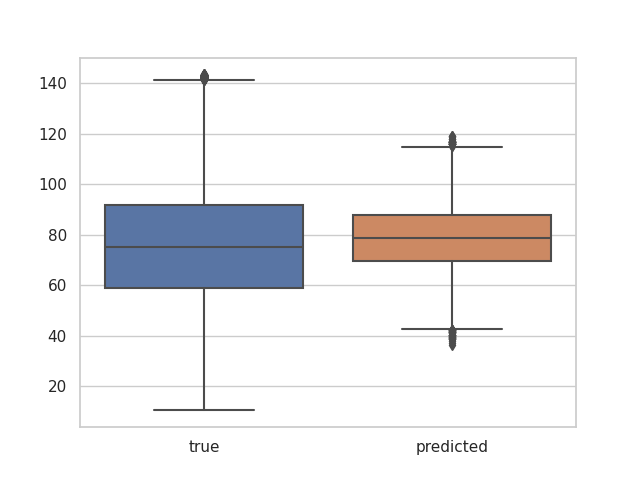
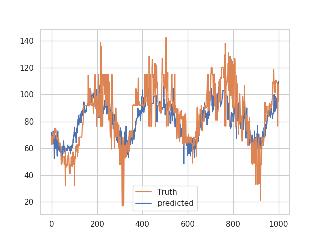
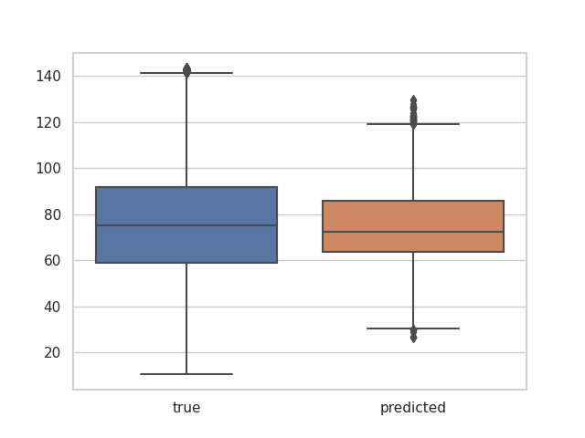
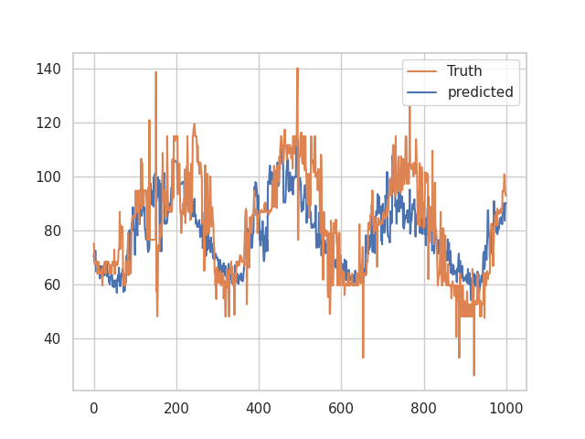
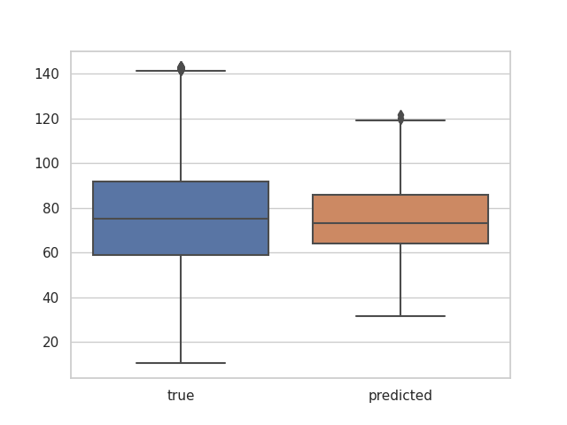

#### Overview
* The results are much more accurate than deepar
* The prediction is able to capture data trend
* Can predict for whole year period at one time instead of using prediction length step by step

#### Model for traning:
https://github.com/automl/auto-sklearn

#### Data
`2017 and 2018` data is used for training and `2019` data is used for testing prediction.

Data for training can be found at `dataset/csv` folder.

#### Preprocess:

* add day type: weekday, Saturday, Sunday/Holiday
* add season: spring, summer, autumn, winter
* handler outliers for all data

#### Example outputs

**Test case 1:**

**Test case 2:**

**Test case 3:**

#### TO DO
* add more features such as: weather, offband, interconnectors
* run extended automl model to get better results
