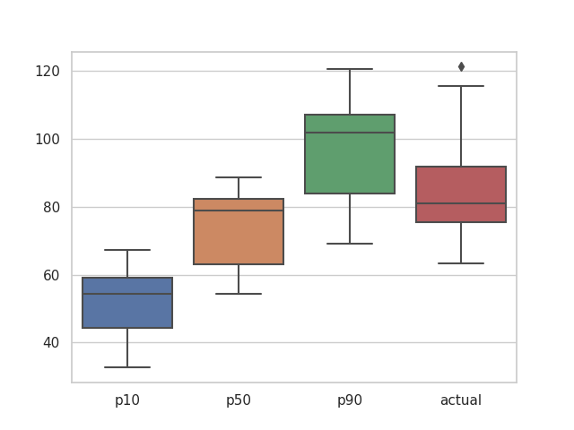

### Results

### Notes

* AWS Forecast predictor takes very long time to finish (more than 5 hours with only 20000 rows of data)
* Get forecast results also slow (~30 mins)
* Based on the logs we can see DeepAR and FB Prophet give the best results with RMSE < 20 so it may be better use those models with SageMaker which is faster and easier to manage.