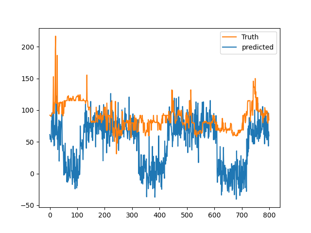
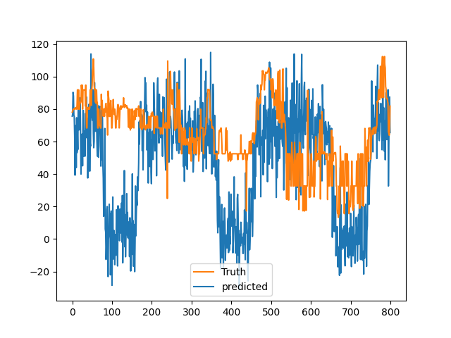

#### Data for training and testing:
* bucket = `007-spot-price-forecast-physical`
* actual_spot_5_mins_path = `nem-pricing-v2/actual_spot_price_5_mins/{}.pickle  # date`
* actual_total_demand_5_mins_path = `nem-pricing-v2/actual_total_demand_5_mins/{}.pickle  # date`
* pv_data_s3_pickle_path = `cache/{}/pv.pickle    # assumptions version`


#### Model for traning:

https://github.com/awslabs/gluon-ts/tree/master/src/gluonts/model/deepar

This is a similar version of SageMaker DeepAR. They both use the same:

* Dataset schema format
* Parameters for estimator


#### POC
Data in `2017 and 2018` is used for training and data in `2019` is used for testing prediction.

* Datetime
* Target is spot price
* Related data contains `demand and pv`
```
freq = "5min"
prediction_length = 800

# Future related data need to be provided when do prediction
```

#### Possible solution for spot price simulation
If the model works well and results are acceptable, we can apply to the current simulation process as following:
* Use historical spot price, total demand, pv, weather and other features for traning
* Use current simulation method and also apply assumptions to produce future data for all features (demand, pv, intercom, etc) but not the spot price the use those data to predict spot price
#### Example outputs





